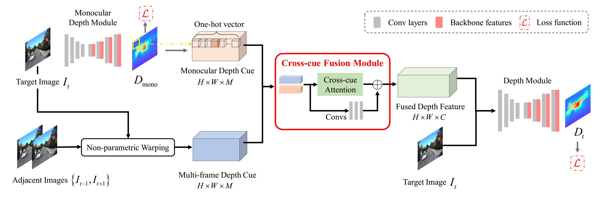

# Dynamic-multiframe-depth

This is the code repository for the paper:
> **Learning to Fuse Monocular and Multi-view Cues for Multi-frame Depth Estimation in Dynamic Scenes**
>
> Rui Li, [Gong Dong](https://donggong1.github.io/index.html), [Yin Wei](https://yvanyin.net/), [Hao Chen](https://stan-haochen.github.io/), Yu Zhu, Kaixuan Wang, Xiaozhi Chen, Jinqiu Sun and Yanning Zhang
> 
> CVPR 2023 [[arXiv]()]


If you use any content of this repo for your work, please cite the following our paper:
```
@InProceedings{li2023learning,
  title = {Learning to Fuse Monocular and Multi-view Cues for Multi-frame Depth Estimation in Dynamic Scenes},
  author = {Li, Rui and Gong, Dong and Yin, Wei and Chen, Hao and Zhu, Yu and Wang, Kaixuan and Chen, Xiaozhi and Sun, Jinqiu and Zhang, Yanning},
  booktitle = {Proceedings of the IEEE/CVF Conference on Computer Vision and Pattern Recognition (CVPR)},
  year = {2023}
}
```

## Introduction
Multi-frame depth estimation generally achieves high accuracy relying on the multi-view geometric consistency. When applied in dynamic scenes, this consistency is usually violated in the dynamic areas, leading to corrupted estimations. Many multi-frame methods handle dynamic areas by identifying them with explicit masks and compensating the multi-view cues with monocular cues represented as local monocular depth or features. The improvements are limited due to the uncontrolled quality of the masks and the underutilized benefits of the fusion of the two types of cues. In this paper, we propose a novel method to learn to fuse the multi-view and monocular cues encoded as volumes without needing the heuristically crafted masks. As unveiled in our analyses, the multi-view cues capture more accurate geometric information in static areas, and the monocular cues capture more useful contexts in dynamic areas. To let the geometric perception learned from multi-view cues in static areas propagate to the monocular representation in dynamic areas and let monocular cues enhance the representation of multi-view cost volume, we propose a cross-cue fusion (CCF) module, which includes the cross-cue attention (CCA) to encode the spatially non-local relative intra-relations from each source to enhance the representation of the other. Experiments on real-world datasets prove the significant effectiveness and generalization ability of the proposed method.
<div align="center">


Overview of the proposed network.
</div>


## Environment Setup

You can set up your own `conda` virtual environment by running the commands below.
```shell
# create a clean conda environment from scratch
conda create --name dymultidepth python=3.7
conda activate dymultidepth
# install pip
conda install ipython
conda install pip
# install required packages
pip install -r requirements.txt
```


## KITTI Odometry Data

We mainly use the KITTI Odometry dataset for training and testing, you can follow the steps below to prepare the dataset. 

1. Download the color images and calibration files from the [official website](http://www.cvlibs.net/datasets/kitti/eval_odometry.php). We use the [improved ground truth depth](http://www.cvlibs.net/datasets/kitti/eval_depth_all.php) for training and evaluation. 
2. Unzip the color images and calibration files into ```../data```. Transfer the initial lidar depth maps to the given format using script ```data_loader/scripts/preprocess_kitti_transfer_gtdepth_to_odom.py```.

3. The estimated poses can be downloaded 
from [here](https://vision.in.tum.de/_media/research/monorec/poses_dvso.zip) and be placed under ``../data/{kitti_path}/poses_dso``. This folder structure is ensured when unpacking the zip file in the ``{kitti_path}`` directory.


4. The dynamic object masks can be downloaded from [here](https://vision.in.tum.de/_media/research/monorec/mvobj_mask.zip). You should unpack the zip file in the ``{kitti_path}`` directory. The data should be put in ``../data/{kitti_path}/sequences/{seq_num}/mvobj_mask``.

The dataset should be organized as follows:
```
  data
   └── dataset
       ├── poses_dvso
       │   ├── 00.txt
       │   ├── 01.txt
       │   ├── ...
       └── sequences
           ├── 00
           |   ├── calib.txt
           |   ├── image_2
           |   ├── image_depth_annotated
           |   ├── mvobj_mask
           |   └── times.txt
           ├── ...
```


## Training

To train the model from scratch, first set the configuration file.
1. Set the `dataset_dir` to the directory where the KITTI dataset is located.
2. Set the `save_dir` to the directory where you want to store the trained models.

Then run the following command to train the model:

```shell
# Here we train our model with ResNet-18 backbone as an example.
python train.py --config configs\train\train_mr_resnet18.json
```

## Evaluation
We provide KITTI-trained checkpoints of our model:

| Backbone |  Resolution | Download |
| --- | --- | --- |
| ResNet-18 | 256 x 512  | [Link](https://drive.google.com/file/d/1IhrBx3bj6H26UDxMNvRxF7xC0C9qqI1u/view?usp=sharing) |
| EfficicentNet-B5 | 256 x 512  | [Link](https://drive.google.com/file/d/1jS1pbCKfYuuoawZ1nnejtGwQV3FhXGcg/view?usp=sharing) |


The checkpoints can be saved in `./ckpt`. To reproduce the evaluation results in the paper, run the following commands:
```shell
python evaluate.py --config configs\evaluate\eval_mr_resnet18.json
```
In the `.json` file, set `checkpoint_location` to the model checkpoints path and set `save_dir` to save the evaluation scores. 
## Acknowledgements
Our method is implemented based on [MonoRec](https://github.com/Brummi/MonoRec). We thank the authors for their open-source code.
